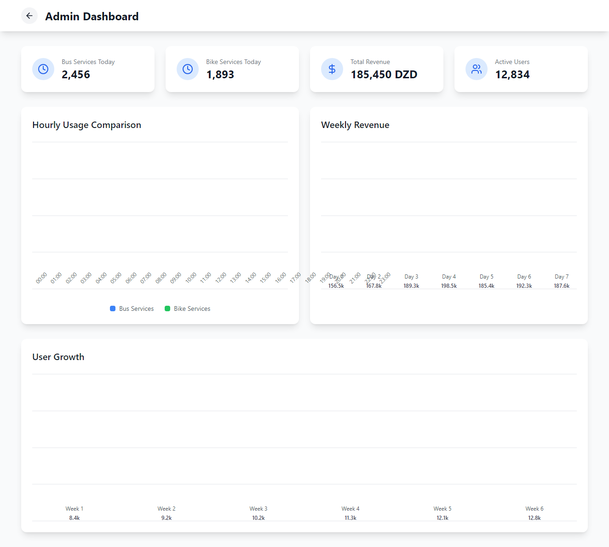
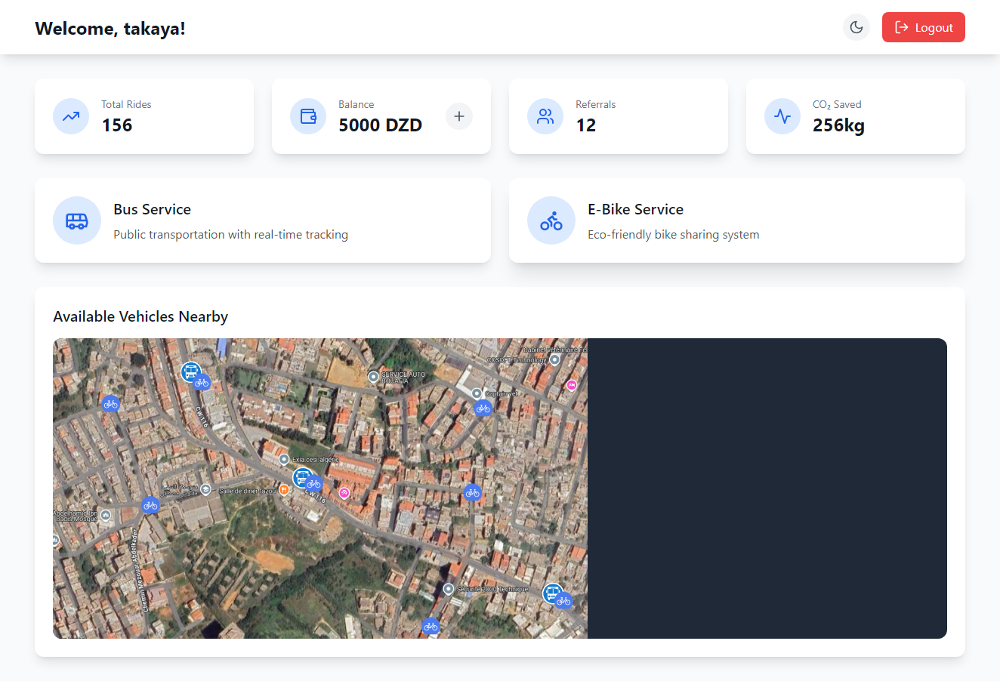

ECOmob is a sustainable urban mobility platform offering integrated bus and e-bike services with smart features to promote eco-friendly transportation. This repository contains the frontend components for the Admin Dashboard, User Dashboard, and Landing Page. The platform is mobile-responsive, and we are planning to develop a mobile app using React Native.

Access the Site
Visit the live site at: https://ecomob.my

QR Code


Scan the QR code to access the site on your mobile device.

---

## Key Features

### 🌍 Landing Page
- **Smart Weather Routing**: Real-time route adjustments based on weather conditions.
- **Eco-Rewards System**: Earn points for choosing green transport (redeemable for free rides, vouchers).
- **Wireless Charging**: Automatic charging at solar-powered stations.
- **Modular Smart Bikes**: Customizable e-bikes with smart security and tracking.
- **Solar-Powered Stations**: Sustainable energy infrastructure for zero-emission charging.

### 👤 User Dashboard
- **Personal Stats**: Track total rides, balance (in DZD), referrals, and CO₂ saved.
- **Nearby Vehicles**: View real-time availability of buses and e-bikes.
- **Services**: Access to real-time bus tracking and eco-friendly bike sharing.

### 🛠️ Admin Dashboard
- **Daily Metrics**: Monitor bus/bike service usage (e.g., 2,456 bus rides today).
- **Hourly Usage Comparison**: Compare bus vs. bike usage trends.
- **Weekly Revenue**: Track revenue across days (e.g., Day 1: 195.5k DZD).
- **User Growth**: Analyze weekly user growth (e.g., Week 1: 8.4k users).

---

## Screenshots

| Admin Dashboard          | User Dashboard           |
|--------------------------|--------------------------|
|  |  |

---

## Data Structure Examples

### Weekly Revenue (Admin)
| Day   | Revenue (DZD) |
|-------|---------------|
| Day 1 | 195.5k        |
| Day 2 | 167.8k        |
| Day 3 | 199.3k        |
| Day 4 | Data Pending  | *// Note: Example placeholder*

### User Growth (Admin)
| Week  | Users  |
|-------|--------|
| Week 1| 8.4k   |
| Week 2| 9.2k   |
| Week 6| 12.8k  |

---

## Getting Started

1. **Clone the Repository**
   ```bash
   git clone https://github.com/your-username/ECOmob.git
Install Dependencies

bash
Copy
npm install
Run the App

bash
Copy
npm start
Mobile Responsiveness & React Native App
The platform is fully mobile-responsive, ensuring a seamless experience across devices. We are also planning to develop a mobile app using React Native to provide a native experience for iOS and Android users.


For Developers & Designers
Tech Stack
Frontend: React, Vite, TailwindCSS
Backend : Sql.
Database : Superbase.


State Management: Zustand

Routing: React Router DOM

Mobile App: React Native 

package.json Dependencies
json
Copy
{
  "name": "vite-react-typescript-starter",
  "private": true,
  "version": "0.0.0",
  "type": "module",
  "scripts": {
    "dev": "vite",
    "build": "vite build",
    "lint": "eslint .",
    "preview": "vite preview"
  },
  "dependencies": {
    "lucide-react": "^0.344.0",
    "react": "^18.3.1",
    "react-dom": "^18.3.1",
    "react-router-dom": "^6.22.2",
    "zustand": "^4.5.2"
  },
  "devDependencies": {
    "@eslint/js": "^9.9.1",
    "@types/react": "^18.3.5",
    "@types/react-dom": "^18.3.0",
    "@vitejs/plugin-react": "^4.3.1",
    "autoprefixer": "^10.4.18",
    "eslint": "^9.9.1",
    "eslint-plugin-react-hooks": "^5.1.0-rc.0",
    "eslint-plugin-react-refresh": "^0.4.11",
    "globals": "^15.9.0",
    "postcss": "^8.4.35",
    "tailwindcss": "^3.4.1",
    "typescript": "^5.5.3",
    "typescript-eslint": "^8.3.0",
    "vite": "^5.4.2"
  }
}
Contributing
Contributions are welcome! Open an issue or submit a PR for improvements.

License
MIT License (see LICENSE for details).

Contact
Support: 

Email: support@smartmobility.com

Address: Hmida B7ar 

© 2015 ECOmob Smart Urban Mobility. All rights reserved.
